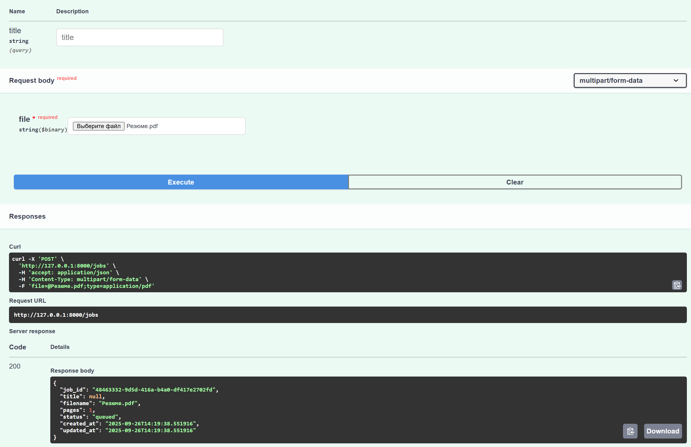
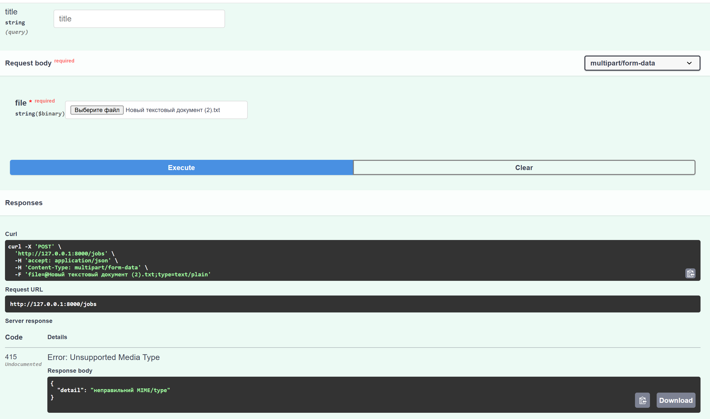
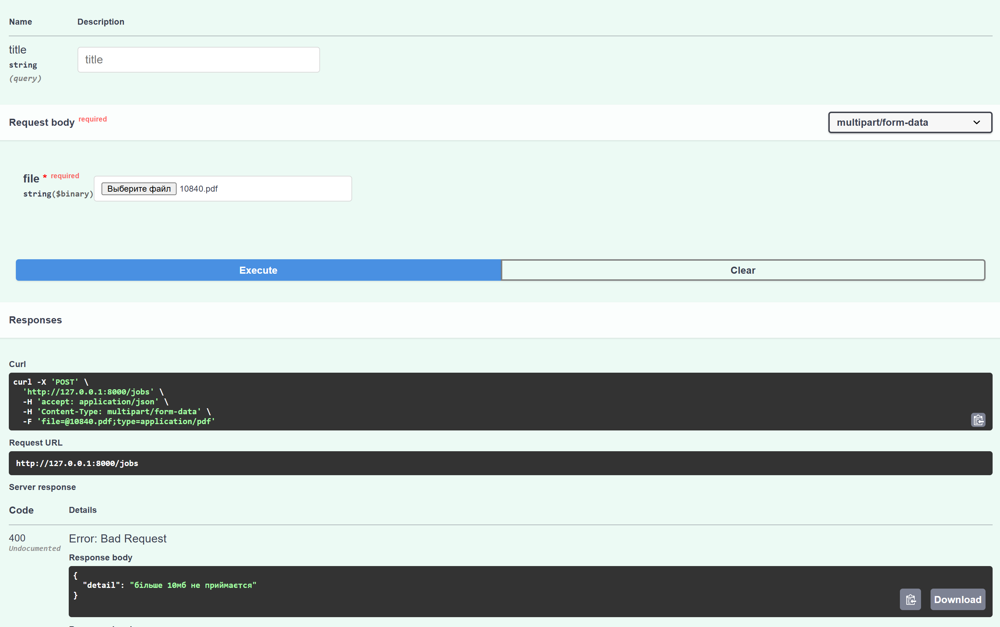
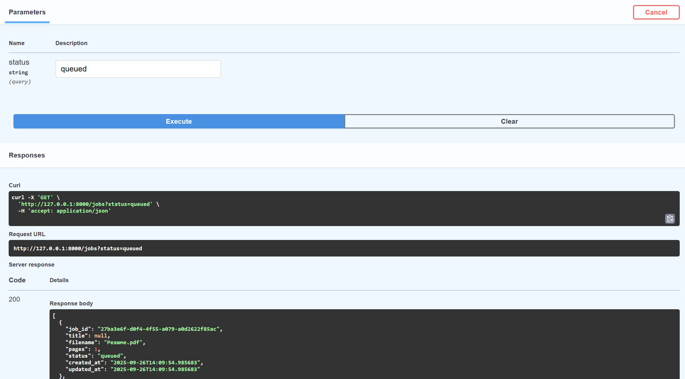
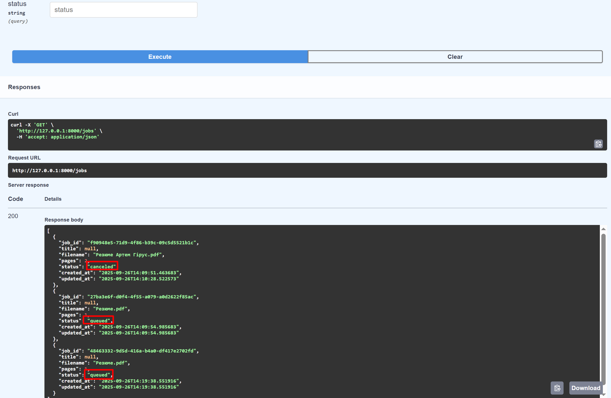
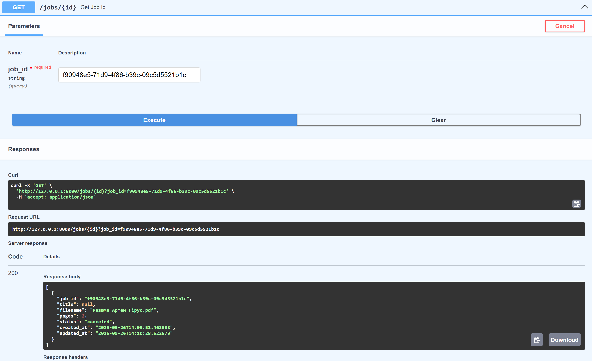
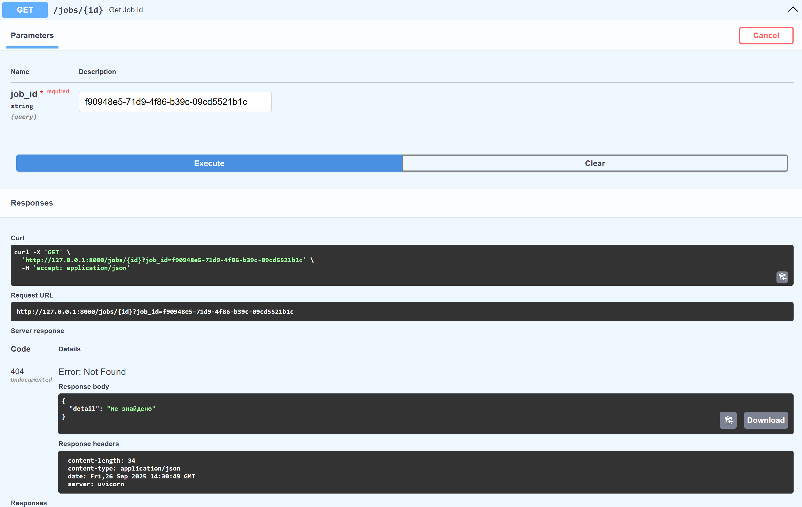
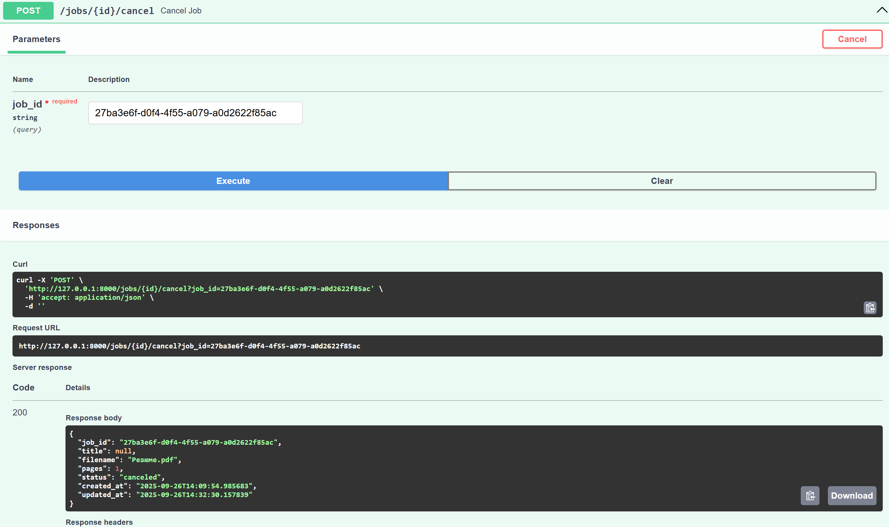
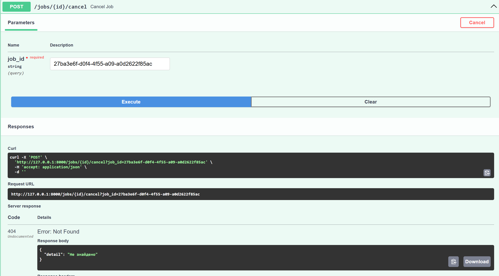

Міні-черга друку (PDF)

Використовувався фреймворк FastAPI()

Цей сервіс дозволяє:  

- Додавати PDF-файли у чергу (`POST /jobs`)  
- Отримувати список задач (`GET /jobs`)  
- Отримувати конкретну задачу за `job_id` (`GET /jobs/{job_id}`)  
- Скасовувати задачу (`POST /jobs/{job_id}/cancel`)

Дані зберігаються в пам'яті процесу, без бази даних. 

Запуск:

Клонування репозиторія: 
- git clone https://github.com/QertySX/test_task.git

Створення та запуск віртуального оточення: 
- python -m venv venv
- venv\Scripts\activate 

Сервер буде доступний за адресою http://127.0.0.1:8000
Документація Swagger: http://127.0.0.1:8000/docs

Example:

1. post(/jobs)

Виключення: 

 

2. get(/jobs) Фільрація за статусом: 

Без параметру відображено усі дані 

3. get(/jobs) Фільрація за id: 

Виключення: 

4. Зміна статусу на Canceled 

Виключення: 
